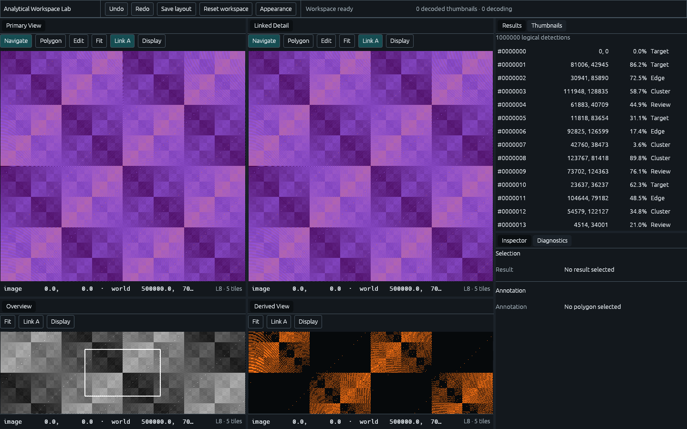

# Polyorama

Polyorama is an experimental Rust framework layer for building GPU-driven
analytical workspaces on native desktop and WebGPU-capable browsers. It brings
together dockable panes, large tiled images, linked views, annotations and
virtualised collections above **egui**, **eframe** and **wgpu**.

The repository contains reusable framework crates, an independent consumer and
three runnable applications:
**Analytical Workspace Lab** exercises an analytical workflow, **Polyorama
Gallery** demonstrates the UI components, and **Emuella Image Viewer** composes
indexed JPEG 2000 regional delivery with multiple views and detection browsing.
They run natively and in the browser from Rust application code.

The project is under active development. Its APIs remain concrete and driven
by the example applications; it is not yet a stable general-purpose framework.

For a first application, use [Record Desk](consumers/record-desk/README.md) and
the [public composition guide](docs/application-composition.md). Record Desk is
its own Cargo workspace: find/edit/review synthetic records, Apply one validated
transaction, undo/redo and save committed records/layout across native restarts
and browser reloads. It imports only public core/UI APIs and owns its domain
rules. The guide also explains the four framework owners, retains a minimal
triangle example and links local rustdoc generation.



*Browser capture from the [design-system verification evidence](docs/design-agent-loop-evidence/README.md).*

## What you can explore

### Analytical Workspace Lab

The Lab is a self-contained demonstration using deterministic synthetic data.
It requires no external datasets, private imagery or service credentials.

- **Multiple image views:** primary, linked detail, overview and derived views,
  with pan/zoom, camera linking and per-view display settings.
- **Progressive image loading:** scalar tiles generated and LZ4-decoded by
  background workers, with bounded scheduling, uploads and GPU residency.
- **Polygon annotation:** create and edit polygons in world coordinates, with
  gesture previews and undo/redo.
- **Large collections:** one million logical result rows and 100,000 logical
  thumbnails, materialising only the visible ranges and overscan.
- **A persistent workspace:** rearrange dock tabs, resize splits, close or reopen
  Diagnostics, save the layout and restore workspace state. Appearance
  preferences include light/dark themes, high contrast, density and font scaling.
- **Diagnostics:** inspect worker state, cache and upload budgets, render
  counters and CPU timings. Unavailable GPU timings are reported as unavailable.

Start by panning the Primary View and observing Linked Detail, then try the
Polygon and Edit tools. Open the Results, Thumbnails and Diagnostics tabs to
explore virtualisation and progressive loading.

Use **View/Panels → Diagnostics** to close or reopen Diagnostics. The menu item
shows whether it is open; **Ctrl/Cmd+Shift+D** toggles it from the keyboard.
Closing Diagnostics gives its dock space to the remaining panes. Reopening adds
the same pane as a tab beside Inspector and selects it. Use **Save layout** to
retain the open or closed state across restarts. Closing and reopening do not
change annotations, selection or cameras.

### Polyorama Gallery

The gallery is the reference application for the shared design system. Its
fixed stories exercise buttons, tabs, splitters, status messages, virtual grids
and application chrome across normal, narrow, long-text, loading and error
states. It also exposes semantic snapshots and text-layout observations for
repeatable UI inspection and verification.

### Emuella Image Viewer

The [viewer application](apps/emuella-viewer/README.md) reconstructs regions and
detection thumbnails from larger indexed HTJ2K codestreams. A shared compressed
cache serves multiple image panes and a virtualised gallery of 10000 logical
detections; display stretch preserves compressed-data identity. Native and
browser workers use Emuella, while Polyorama owns generic demands and bounded
decoded/GPU resources.

Start with the [preparation and local service commands](docs/emuella-viewer-service.md),
then run the native application or its same-origin browser build. Deterministic
fixtures require no external imagery. The [calibration guide](docs/emuella-viewer-calibration.md)
distinguishes current evidence and frozen limits from final qualification.

## Run locally

Run these commands from the repository root.

### Prerequisites

- Rust and Cargo. [The repository toolchain](rust-toolchain.toml) and
  [CI](.github/workflows/verify.yml) select Rust **1.99.0** for development and
  verification. The workspace minimum remains Rust **1.97.1**.
- For native applications, a graphical session and a working graphics backend
  supported by wgpu. Linux builds enable X11 and Wayland support.
- For browser builds, the `wasm32-unknown-unknown` target,
  **wasm-bindgen-cli 0.2.127**, and a browser with WebGPU available.
- Python 3 for the optional local HTTP server shown below.
- Node.js and npm for automated browser/UI verification. CI currently uses
  Node.js **25.8.2**; Playwright is pinned in `package-lock.json`.

### Native desktop

Launch the analytical workspace:

```sh
cargo run --release -p analytical-workspace-lab
```

Or launch the component gallery:

```sh
cargo run --release -p polyorama-gallery
```

### Browser

Install the browser build tools once. The CLI version must match the version
expected by `xtask`:

```sh
rustup target add wasm32-unknown-unknown
cargo install --locked wasm-bindgen-cli --version 0.2.127
```

Build both applications and the tile Web Worker, then serve the Lab:

```sh
cargo xtask build-web
python3 -m http.server 8080 --bind 127.0.0.1 --directory apps/analytical-workspace-lab/web
```

Open [Analytical Workspace Lab](http://localhost:8080). To run the gallery in
another terminal:

```sh
python3 -m http.server 8081 --bind 127.0.0.1 --directory apps/polyorama-gallery/web
```

Open [Polyorama Gallery](http://localhost:8081). Serve the files over HTTP rather
than opening `index.html` directly. Browser rendering requires WebGPU; there is
no WebGL fallback. Re-run `cargo xtask build-web` after changing Rust code.

For measured production packaging, compression, immutable asset URLs and consumer
workspace setup, use the [browser build and startup guide](docs/browser-startup.md).
For a managed private HTTPS preview of the Lab from a development worktree, use
the [private development preview guide](docs/private-preview.md).

## How the project fits together

Polyorama separates application state, asynchronous work, GPU resources and UI
presentation so each has a clear owner.

| Package | Responsibility |
| --- | --- |
| [`polyorama-core`](crates/polyorama-core) | Documents, session state, the serialisable dock tree, validated commands, typed coordinates and renderer-independent demands. No egui, wgpu or browser dependencies. |
| [`polyorama-runtime`](crates/polyorama-runtime) | Demand reconciliation, bounded worker scheduling and completion state. Independent of egui and wgpu. |
| [`polyorama-render-wgpu`](crates/polyorama-render-wgpu) | Persistent GPU resources, tile residency and typed render requests shared across viewports. |
| [`polyorama-ui-egui`](crates/polyorama-ui-egui) | The framework's egui integration: dock presentation, measured components, typed design tokens and semantic UI observations. |
| [`record-desk`](consumers/record-desk) | Independent native/browser record workflow with its own manifest, dependencies and lockfile; no image renderer/runtime or application-package dependency. |
| [`analytical-workspace-lab`](apps/analytical-workspace-lab) | The analytical demo, its feature panes and application-owned actions. |
| [`minimal-workspace` example](apps/analytical-workspace-lab/examples/minimal-workspace.rs) | A small native consumer using public framework APIs and existing package dependencies, independent of Lab implementation. |
| [`polyorama-gallery`](apps/polyorama-gallery) | The component catalogue and deterministic UI stories. |
| [`polyorama-tile-worker`](apps/tile-worker) | The browser Web Worker entry point for tile preparation and decoding. |
| [`xtask`](xtask) | Builds, architecture checks, token generation and verification tooling. |

The serialisable `polyorama_core::Workspace` is the sole authoritative dock
tree. Pane presenters receive narrow state views and emit intents; validated
commands apply changes. Durable annotations live in the document, while
selection, cameras, tools and gesture previews live in the session.

Data requests describe desired state. The runtime reconciles and deduplicates
them before scheduling work and rejects stale completions. The renderer owns
GPU resources across all viewports, and repainting is driven by recorded work
or interaction rather than an unconditional frame loop.

## Development and verification

The canonical verification command is:

```sh
cargo xtask verify
```

It checks generated-token drift, formatting, native and WASM Clippy, workspace
tests and architecture boundaries; builds release native and browser artefacts;
and runs application/gallery browser smokes and deterministic UI snapshots.
Explicit Record Desk checks cover its excluded Cargo workspace, dependency
independence, tests, native/WASM lint/build and physical native/browser workflows.
On Linux it also runs native interaction smokes. Generated evidence goes to
the ignored `.tools/runtime/verification-evidence/` directory.

Full verification requires the browser build tools above, Rust's `rustfmt` and
`clippy` components, Node.js/npm and the platform's browser/graphics libraries.
It runs `npm ci` and installs Playwright Chromium, so the first run needs network
access and can take longer than ordinary Rust tests.

On Linux, the default [bootstrap script](tools/bootstrap-linux-ui.sh) unpacks
pinned x86_64 UI packages into `.tools/`; that path also relies on tools such as
`curl`, `bsdtar`, `bwrap`, ImageMagick, `jq` and `rg`. For a system-library setup, use
`POLYORAMA_USE_SYSTEM_UI_LIBS=1` and provision the dependencies and display as
shown in the [Ubuntu CI setup action](.github/actions/setup-verification/action.yml).

Hosted verification runs eight stages in parallel and requires all of them under
the final `verify` check. The local command runs the same stages sequentially.
See [CI verification and cache ownership](docs/ci-cache.md) for the stage
inventory, focused reproduction commands and timing limits.

For focused development checks:

```sh
cargo test --workspace
cargo xtask architecture
cargo xtask tokens check
cargo xtask ui list --output-dir .tools/runtime/ui-list
```

UI rendering and snapshot checks require built browser packages. See the
[snapshot guide](docs/ui-snapshots/README.md) for exact capture, inspection and
verification commands. Baselines are reviewed source artefacts; verification
does not update them automatically.

## Documentation

- [Working rules](AGENTS.md): architectural boundaries and contribution expectations.
- [Application composition](docs/application-composition.md): four-crate lifecycle,
  local rustdoc, a minimal native consumer and a public presenter variation.
- [Application inspection and exercise](docs/application-interface.md): shared
  native/browser client, typed discovery and invocation, bounded queries and
  waits, physical targeting and capture provenance.
- [UI guides](docs/ui-guides/README.md): entry point for component, pane,
  interaction, accessibility and UI review work.
- [Design language](docs/design-language.md): visual and semantic contracts,
  backed by the [token source](design/tokens/polyorama.tokens.json).
- [UI evaluation seed](docs/ui-evaluation-seed.md): frozen tasks and explicit
  scoring criteria for repeatable UI evaluation.
- [Regional adapter contract](docs/regional-adapter-contract.md): immutable
  parent-image demands, external workers, resource accounting and integer display.
- [Vertical-slice contract](docs/vertical-slice-goal.md) and
  [report](docs/vertical-slice-report.md): the Lab's original requirements,
  architecture, hardening results and retained runtime evidence.
- [Design-system report](docs/design-agent-loop-report.md): the component
  system, application migration and native/browser verification evidence.
- [Accessibility integration evidence](docs/accessibility-integration-report.md):
  adapter decisions, automated proof and the exact assistive-technology
  qualification matrix.

## Current limits

Polyorama compiles eframe's native AccessKit adapter and is
**AccessKit-semantic and keyboard-tested**. The representative workflow is
directly qualified with human-confirmed audible Orca output for the exact
Debian 13/GNOME 48/RDP/Orca 48.1 environment. Its tests cover roles, names,
states, bounds, actions, semantic parity and keyboard operation, but that one
versioned result is not evidence of screen-reader support on Windows, macOS,
other Linux configurations or browsers.
Stock eframe 0.36.1 discards browser AccessKit updates and provides no web
accessibility-tree adapter; the retained upstream reproduction and exact
qualification state are in the
[accessibility integration evidence](docs/accessibility-integration-report.md).
The exact qualification and remaining platform boundaries are recorded there.

The synthetic source and decoder demonstrate the architecture; they are not
production image codecs or remote data integrations. Production geospatial
reprojection, arbitrary texture import and a general-purpose render graph are
outside the current implementation. Diagnostics is the only closeable pane in
Analytical Workspace Lab. Reopening places it beside Inspector rather than
recreating its exact former split or tab position; arbitrary pane creation and
closing other panes remain unimplemented.

Retained native runtime evidence uses Mesa llvmpipe under Xvfb, so it establishes
functional behaviour rather than physical-GPU performance. GPU timestamps are
unavailable in the documented captures. See the reports above for the tested
environments and the scope of each performance observation.

## Licence

Polyorama and its workspace packages are licensed under
[Apache License 2.0](LICENSE).
