# Analytical Workspace Lab vertical-slice report

Date: 28 August 2026

Specification: [`vertical-slice-goal.md`](vertical-slice-goal.md)

Licence: Apache-2.0

## Summary

Polyorama now contains a runnable, application-shaped analytical workspace built from one Rust application model for native desktop and WebAssembly/WebGPU. The default serialisable dock workspace contains four separately interactive GPU image panes plus Results, Thumbnails, Inspector and Diagnostics. It exercises progressive LZ4-decoded scalar tiles, camera linking, world-coordinate polygon editing with undo/redo, virtual collections, persistence, explicit repaint scheduling and structured instrumentation.

The complete release verification passed on both targets. The native binary was launched under a user-space Xvfb display and rendered through wgpu's OpenGL backend on Mesa llvmpipe. The WebAssembly build was launched in headless Chromium with real WebGPU, a module Web Worker and persisted browser storage. Both paths were interacted with and captured; neither result rests on compilation alone.

The architectural hypothesis is supported: this slice did not reveal a need to replace egui. A narrow egui integration layer presents a canonical retained workspace and submits a complete typed frame render plan into one renderer-owned wgpu resource universe. The retained 0.1.0 profile identified fixture production during rapid zoom, rather than egui presentation, as the strongest measured limitation. Version 0.1.1 moved deterministic scalar generation and LZ4 work behind the worker boundary and added bounded desired-set scheduling; the same release-browser rapid-zoom scenario improved from a 126.3 ms p95 baseline to 0.9 ms p95 without changing the GUI substrate. Version 0.1.2 closed lifecycle gaps around unavailable workers, hidden image panes, linked wheel gestures and checked render-plan publication. Version 0.1.3 corrected and requalified physical pan and gallery scrolling. Version 0.1.4 consolidated virtual-grid geometry, preserved wheel propagation at scroll boundaries, closed exceptional camera-drag lifecycles and made physical smoke targeting layout-resilient through Rust-owned semantic geometry. Version 0.1.5 corrected physical dock-split resizing and closed pane interaction clipping at the dock boundary. Version 0.1.6 preserves a vertex edit's final preview through its release frame and makes delayed drag recognition retain the press origin; its physical rapid-zoom capture measured a 0.8 ms p95.

Important limitations are documented below. In particular, native evidence uses a software adapter, browser adapter naming is unavailable, GPU timestamps are unavailable, and the synthetic data/decoder is an architectural fixture rather than a production image codec.

## Version 0.1.1 architecture hardening

The no-new-features hardening pass made the architectural claims reviewed after 0.1.0 mechanically true:

- one preview camera is calculated before tile demand, render planning, annotations, pointer coordinates and overview presentation; linked panes receive the same transient value, and a deterministic test fixes this ordering;
- camera commands record exact before/after values for every affected pane, link joins synchronise explicitly, undo is independent of later link topology, and a wheel burst coalesces after 140 ms;
- feature presenters receive camera, tool, gesture, selection, diagnostics and virtualisation projections instead of mutable access to the complete `Session`; Results, Thumbnails and Inspector are separate feature modules;
- `FrameOutput` owns the actual `RenderPlan`; `polyorama-ui-egui` stages opaque callbacks in the correct egui paint lists, then the application publishes the final cross-pane preview requests before wgpu preparation begins;
- the renderer is the only GPU-residency authority. Runtime/renderer transitions carry exact request tokens, and the application no longer mirrors scalar resident keys;
- reconciliation compares complete desired sets, rejects stale demand generations before admission, keeps the complete outstanding scheduler set within its configured capacity, retains tokens only for retained work, obsoletes disappeared work, bounds native/browser/decoded/renderer queues, reprioritises retained demand and strictly rejects unknown, obsolete, superseded or duplicate completions;
- source-generation changes clear old renderer textures, queued uploads and residency acknowledgements before drawing, while restored application state must contain the exact registered pane, camera, tool and display mappings with valid selections;
- dock presenters receive the canonical pane body for bounded viewport/status geometry, deferred status paint is explicitly clipped, and an aborted tab or splitter drag clears its interaction state instead of driving an idle repaint loop;
- synthetic production, portable little-endian encoding, LZ4 compression and decode execute behind the worker request boundary; browser worker construction, transport, message and execution failures become explicit diagnostics;
- decoded thumbnail pixels are displayed through a bounded 4 MiB egui texture cache; the million-row result view explicitly materialises its visible range plus eight overscan rows;
- latency p50/p95 values are real bounded-window percentiles, renderer preparation accumulates across jobs, paint callbacks/draws are counted when invoked, returned command buffers are truthfully zero, actual render-pass topology remains unavailable, and application update CPU time is labelled as such;
- Rust-owned browser test actions and snapshots establish linked-camera, render-plan, command-history, annotation, canonical workspace, queue-bound, decoded-thumbnail and warmed-idle correctness. The browser and native physical harnesses resolve pane, tab, splitter, control and scroll rectangles from the current Rust frame instead of embedding layout coordinates.

The reusable crates were renamed to `polyorama-core`, `polyorama-runtime`, `polyorama-render-wgpu` and `polyorama-ui-egui` before external consumers existed. All workspace packages use Apache-2.0.

## Version 0.1.2 lifecycle closure

The second no-new-features hardening pass closes the remaining reviewed edge cases:

- runtime transport is explicit. Native instances cannot fall through to the browser request queue, native event-channel disconnection is terminal even after the final dispatch, and terminal native or browser Worker state converts current and later desired work to `Failed` without leaving queued, in-flight, external or browser-credit state. Demands outside the declared pyramid are rejected before admission and worker-side fixture arithmetic is defensive;
- renderer maintenance is staged once before pane presentation. Upload, generation and per-frame metric work therefore progresses with zero visible image panes; the real WebGPU probe uploaded a pending tile with only Results visible, reported zero image jobs/callbacks, then held frame 22 over the warmed-idle interval;
- an upload that becomes obsolete before renderer acknowledgement remains a valid runtime `Resident` entry, so a later re-demand is a cache hit rather than a duplicate decode;
- render-plan publication checks request/target count, order, pane identity and uniqueness before mutating a callback target. A mismatch disables every staged image callback and returns an ordinary error in debug and release builds;
- wheel sessions are keyed by camera-link scope and expired in one frame-global pass. A hidden origin still finalises, input crossing linked panes remains one command, unlinked panes remain independent, and wheel-to-drag hand-off commits the wheel preview before the drag begins;
- the pane shell constructs an immutable `PaneReadModel` and feature-scoped `PaneFeatureState`. Active tools, annotation selection and display settings flow back through explicit `PaneIntent` values and application validation;
- the former 1,466-line presenter is split into image, camera-gesture, annotation, diagnostics, results, thumbnails and inspector modules. Architecture verification rejects broad mutable projections, feature implementations in the dispatcher and missing lifecycle enforcement;
- renderer diagnostics now name image paint callbacks and renderer-returned command buffers directly, while actual render-pass topology is serialised as unavailable;
- Rust-owned browser probes establish both failure modes: zero-viewport upload/idle and terminal Worker failure followed by new demand. The latter terminates the Worker object, reported one failed demand, zero queued/in-flight/external work, zero credits in use and an unchanged frame 9 over the idle interval.

## Version 0.1.3 physical interaction verification

The third no-new-features hardening pass corrects the two physical regressions
found after 0.1.2 and makes their acceptance evidence semantic rather than
visual:

- `CameraDragSession` owns the exact initial linked-camera set, total physical
  displacement, same-frame preview and exact completion changes. The presenter
  derives displacement from the pointer press origin, so movement before egui's
  drag-recognition threshold and a final move coalesced with release are retained
  without repeatedly mutating a camera;
- `VirtualGridPresenter` in `polyorama-ui-egui` presents 100,000 logical items
  through `ScrollArea::show_rows`, establishes the exact 33,334-row extent,
  positions only visible rows plus two rows of overscan, retains the scroll
  state under a stable ID and exposes the visible/materialised ranges, offset,
  content height, viewport height and signed wheel input;
- Diagnostics count raw physical wheel events separately from presenter input
  frames and report the thumbnail grid geometry, scroll offset/extent and exact
  materialised item range;
- the browser smoke surrounds a real 90-by-50 Playwright drag with Rust-owned
  snapshots, asserts the exact linked camera transform and render camera, then
  asserts one undo restores both original cameras exactly;
- the native smoke repeats the same drag/linked/undo checks through xdotool and
  writes structured physical evidence. Its display uses a repository-owned
  X11 temporary directory, avoiding dependence on shared `/tmp` capacity and
  stale display locks;
- both smokes send five physical wheel steps over the gallery and require an
  increased offset, an advanced visible range, later demanded/resident keys,
  bounded materialisation and a cache below 4 MiB. In the browser capture the
  visible range advanced from `0..18` to `45..63` at an offset of about 1,503
  points;
- the performance observations below now measure a confirmed full physical pan
  and confirmed physical thumbnail scroll. The Rust semantic control surface
  remains useful for architecture and lifecycle tests, but is no longer
  accepted by itself as proof of user-input behaviour.

## Version 0.1.4 interaction polish

The fourth no-new-features hardening pass closes the reusable interaction seams
identified before usage-led development:

- `polyorama_core::layout_virtual_grid` is the single pure authority for total,
  visible and overscanned row/item ranges. `VirtualGridPresenter` supplies the
  exact egui visible rows and delegates all range clamping and row-to-item
  mapping to that helper;
- a smallest headless probe showed that removing the gallery's compatibility
  path did not advance retained scroll state in the pinned integration. The
  presenter therefore mirrors egui's movement-possible checks and
  single-enabled-axis wheel combination, clearing input only after the offset
  can move. Short grids and top/bottom boundaries leave the delta available to
  a containing scroll area;
- a camera drag whose total displacement returns exactly to zero restores the
  exact pre-gesture preview and emits no `SetCameras` command or undo record.
  Focus loss and terminal pointer loss cancel retained drag previews explicitly;
  normal release still samples the final pointer before committing;
- the application snapshot reports current-frame logical rectangles for pane
  bodies, tabs, splitters, image viewports, toolbars, named controls, result rows
  and scroll areas. Playwright maps them through the live canvas and xdotool
  through the live X window, so both physical harnesses select semantic targets
  without hard-coded screen positions;
- the browser physically exercised a 60-by-30 drag out and exact return and
  proved unchanged linked cameras and unchanged undo depth. Deterministic egui
  tests cover focus and `PointerGone` cancellation;
- a release WebGPU canvas was separately inspected through Lantern at 800×600.
  It rendered the four scalar viewports and complete desktop workspace without
  console, network, layout or blank-canvas findings.

## Version 0.1.5 splitter interaction repair

A user-driven physical check exposed that highlighted dock dividers only
wobbled and did not retain a new position. The earlier smoke moved the pointer
and captured pixels but did not assert splitter geometry or the canonical
workspace, so it could not detect the no-op command. This repair closes both
the interaction defect and that evidence gap:

- the splitter preview is derived from the current pointer minus the retained
  gesture origin. It therefore follows total displacement, remains stable on
  idle drag frames and samples a final movement delivered in the release frame;
- release preserves the last preview and emits one `ResizeSplit` command only
  when its before and after fractions differ. `CommandHistory` independently
  rejects a no-op split command;
- pane presentation is clipped to its assigned dock body. This prevents a
  later child interaction—specifically the active thumbnail grid—from winning
  hit-testing across the adjacent splitter;
- deterministic egui tests prove live preview tracking, idle retention,
  release-edge sampling, exact undo, out-and-back suppression and clipping
  against an intentionally overreaching child presenter;
- Playwright and xdotool each move the main splitter 47 points, require the
  reported divider centre and workspace hash to change, require exactly one
  undo record, exercise exact undo/redo and prove an out-and-back physical drag
  creates no workspace or history state. The browser additionally records all
  six preview samples and requires them to track the pointer;
- an independent release WebGPU inspection moved the divider 80 points, saw the
  workspace hash change and one undo record, and found a visibly rendered
  canvas with no layout, console or network findings.

## Version 0.1.6 vertex release-frame repair

A user-driven polygon edit exposed a one-frame visual hand-off gap on mouse
release. The presenter removed the session preview and queued `MoveVertex`
before it cloned the frame overlay, while the document command was applied only
after presentation. That release frame therefore painted the old vertex before
the command-triggered repaint showed the new one. This repair makes the frame
and physical evidence match the intended interaction contract:

- completing a vertex drag moves its final `GesturePreview::Vertex` into the
  current `FrameOutput`. Every image overlay uses that frame-local value until
  the queued document command becomes authoritative on the next frame;
- vertex movement samples both ordinary drag frames and the release frame, so a
  final pointer movement coalesced with mouse-up is included in the preview and
  command;
- vertex hit-testing reconstructs the original press position from egui's total
  drag displacement. Delayed recognition can no longer test a later pointer
  position outside the vertex's 16-point hit radius;
- deterministic egui tests prove retained press-origin hit-testing and prove
  that a stale per-pane preview is overridden by the final release preview
  while the exact `MoveVertex` command is queued;
- Playwright and xdotool each move the selected vertex 35 by 25 screen points,
  require the exact affine-transformed world coordinate, require one undo
  record and prove exact undo/redo. Both use paced physical movement so the
  event-driven application observes the gesture rather than a synthetic
  press/move/release burst with no presentation opportunity;
- an independent release WebGPU inspection rendered a nonblank four-viewport
  workspace at 800×600 with no console, network or layout findings.

## Architecture

### Crates and ownership

| Component | Responsibility | Enforced boundary |
| --- | --- | --- |
| `polyorama-core` | Typed IDs and coordinates, document/session state, canonical `Workspace`, intents, commands, undo/redo, renderer-independent demand and diagnostics types, virtual-range calculations | No egui, eframe, wgpu, web or windowing dependency |
| `polyorama-runtime` | Demand reconciliation, resource state machine, priorities/generations/failures, common decode protocol, native worker, browser request queue, LZ4 decode, CPU cache policy and runtime metrics | No egui or wgpu dependency; workers receive bytes and typed keys only |
| `polyorama-render-wgpu` | Typed `ImageRenderRequest`, scalar textures, WGSL display pipeline, shared residency, upload budget, physical viewport/scissor rendering and renderer metrics | Depends on wgpu, not egui; creates no device or queue |
| `polyorama-ui-egui` | Canonical dock-tree presentation, semantic UI identity, typed viewport allocation/input translation and the hidden `egui_wgpu` callback bridge | The only framework crate that understands egui |
| `analytical-workspace-lab` | Demo composition, narrow pane projections/sinks, persistence, synthetic source selection, native and browser entry points | Owns orchestration, not reusable GPU/runtime internals |
| `polyorama-tile-worker` | Separate browser Worker Wasm entry point using the common runtime protocol | No UI or GPU object is accepted or owned |
| `xtask` | One deterministic verification entry point and mechanical architecture checks | Fails rather than silently weakening a target check |

State ownership follows the specification: annotations are document state; dock nodes, pane configuration and active pane are workspace state; selection, cameras, links, tools and gesture previews are session state; drag/hover geometry is UI behaviour; texture/pipeline/cache/upload state is renderer-owned; and demands, generations, failures and worker queues are runtime-owned. Egui memory is not authoritative for document, workspace or selection state.

### Frame flow

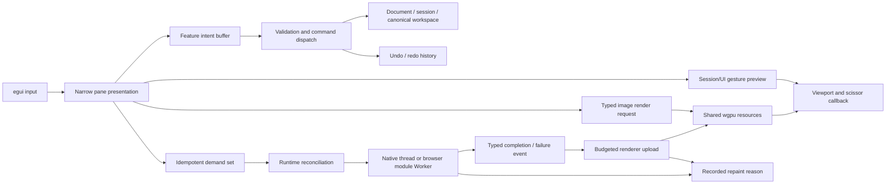

An intent records a feature-scoped request. Validation creates a durable command; the history applies it and supplies undo/redo. Gesture previews remain transient and a completed camera drag, vertex drag or polygon construction produces one command. No asynchronous domain effect was needed in this fixture: persistence is an explicit shell operation, while decode work is expressed as idempotent demand and typed runtime events rather than disguised as commands. The distinction remains mechanical in `FrameOutput`, `ImageIntent`, `Command`, `TileDemand`, `DecodeEvent`, `ImageRenderRequest` and `RepaintReason`.

`polyorama_core::Workspace` is the only dock-tree representation. The egui presenter walks that tree directly and keeps only a transient split preview; it has no mirrored docking model. Stable `DockNodeId` and `PaneId` values survive rearrangement and JSON restoration. Releasing a splitter emits one undoable `ResizeSplit` command, while pane drops modify the canonical tree and prune vacated splits deterministically.

The application obtains eframe's wgpu render state once and installs one `ScalarRenderer` in callback resources. Every pane callback receives that same device and queue. Renderer-owned `R16Uint` textures, pipelines, buffers, bind groups and cache entries are shared by tile key. Each tile's image extent is transformed through the request camera into viewport geometry before the custom shader draws it, so pan and zoom affect the scalar raster itself. The callback bridge converts egui allocation and clipping into physical viewport/scissor rectangles; pane code does not see a device, queue, render pass or persistent GPU object.

Native decode uses a named background thread and an explicit egui repaint waker. Browser decode uses a real module `Worker`, a separately built worker Wasm package and the same serialisable `DecodeRequest`/`DecodeEvent` protocol. Only decoded CPU buffers return for GPU upload. Repaints are requested for recorded interaction, command, completion or pending-upload reasons; there is no unconditional frame request.

## Acceptance matrix

`Verified` means an automated test, runtime observation, screenshot, mechanical boundary check, or a combination of those sources directly exercised the claim.

| ID | Criterion | Status | Concrete evidence | Notes |
| --- | --- | --- | --- | --- |
| A01 | Required document/workspace/session/UI/GPU/runtime ownership; no authoritative domain state in widget memory | Verified | `app.rs`, `panes/`, `diagnostics.rs`; `cargo xtask architecture` | Selection and layout live in Rust models. UI behaviour contains only transient camera drag/pointer state. |
| A02 | Egui is immediate presentation through narrow pane APIs | Verified | `PaneReadModel`, `PaneFeatureState`, `PaneIntent`; `panes/{image,camera_gestures,annotations,diagnostics,results,thumbnails,inspector}.rs`; recursive architecture source scan | Pane code has no mutable complete app/session/runtime/workspace or wgpu/egui-wgpu access; authoritative tool, display and annotation-selection changes are shell-validated intents. |
| A03 | Intent, command, event, demand, render request and repaint outputs remain distinct | Verified | `ImageIntent`, `Command`, `DecodeEvent`, `TileDemand`, `ImageRenderRequest`, `RepaintReason`; command validation tests | Decode is demand/event work; persistence is a shell operation. No speculative effect abstraction was added. |
| A04 | Live interaction preview and one durable command per completed gesture | Verified | Camera and splitter total-displacement/out-and-back tests; vertex release-frame and retained-press-origin tests; no-op history defence; coalesced final-move/release egui tests; focus/terminal-pointer cancellation tests; exact linked-camera, splitter and vertex history checks; browser/native physical drag and undo/redo assertions; hidden-origin, cross-linked, unlinked and wheel-to-drag lifecycle tests | Raster, overlays, coordinates, overview and demands share one preview camera; vertex release retains its final overlay until the document command is visible; camera and splitter drags include release-edge movement, exact origin return creates no command, abnormal camera termination cancels, and wheel bursts coalesce by link scope after 140 ms. |
| A05 | Exactly one canonical, versioned dock tree with stable IDs, splits, tabs, resizing, active pane and drag/drop | Verified | Stable `DockNodeId`; node/pane invariant, rearrangement, schema and round-trip tests; `browser-rearranged-dock.png`; native restored layout | Optional close/create was not implemented because it is conditional “where supported”; all mandatory panes remain restorable through Reset. |
| A06 | One shared wgpu device/queue and renderer resource universe for all viewports | Verified | `ScalarRenderer` is inserted once from `CreationContext::wgpu_render_state`; architecture scan rejects viewport device creation; diagnostics report four GPU viewports | No texture-import or per-pane device architecture exists. |
| A07 | Typed render plan and correct logical/physical viewport, scale, clipping, focus and pointer-local mapping | Verified | Real `FrameOutput::render_plan`, pane-identified opaque targets, count/order/duplicate rejection test, geometry tests and semantic render-camera snapshot | The shell finalises cross-pane preview cameras and demands, validates exact request/target correspondence, then publishes the complete plan before callback preparation. |
| A08 | Semantic identity is stable across rearrangement | Verified | IDs are scoped from window/pane/feature/domain IDs; pane stability and restored-dock tests | No call-order counter is used as semantic identity. |
| A09 | Typed UI, physical, viewport, image and world coordinate spaces plus deterministic affine transform | Verified | Coordinate newtypes and affine round-trip test; viewport status lines; world-coordinate annotations | Screen tuples do not cross the domain/render boundary as ambiguous coordinates. |
| A10 | Agent-friendly dependency direction and durable rules | Verified | `cargo xtask architecture`; `AGENTS.md`; workspace crate graph | Core reducers run with no window/GPU. No fork or general GUI core was introduced. |
| D01 | Deterministic scalar virtual raster ≥131072², 256² tiles, multiresolution, compressed worker path, never fully allocated | Verified | `TILE_SIZE`, `PYRAMID_LEVELS`, `visible_tile_demands`, deterministic tile function and LZ4 decode test; worker runtime evidence | Allocation is per demanded tile only. |
| D02 | At least 1,000,000 deterministic logical results without a million row structures | Verified | `RESULT_COUNT`, `result_at`, virtual-row tests; Diagnostics screenshot | Rows are calculated from index and stable `ResultId`. |
| D03 | At least 100,000 logical thumbnails, progressively demanded without creating/requesting all | Verified | `THUMBNAIL_COUNT`; canonical pure grid-layout tests; exact-extent, short-grid, directional-boundary, axis-combination and physical-wheel `VirtualGridPresenter` tests; native/browser scroll snapshots; Source 2 worker demands | Visible cells plus two overscan rows are requested; the captured browser range advanced from `0..18` to `45..63`. |
| W01 | Default workspace contains four GPU views and Results, Thumbnails, Inspector, Diagnostics | Verified | Default dock invariant lists panes 1–8; native/browser default screenshots; readiness asserts pane count 8 | Results/Thumbnails and Inspector/Diagnostics are tab stacks. |
| F01 | Resize, tabs, horizontal/vertical dock drops, activation, reset, save and deterministic restore | Verified | Browser/native semantic splitter centre, workspace-hash and exact undo/redo assertions; browser six-sample preview trace; out-and-back no-op checks; clipped-pane egui regression test; Playwright/native pane drag, save and restart; round-trip and schema tests | Splitters track total pointer displacement and commit one non-empty command; empty source nodes are pruned after moves. |
| F02 | Non-RGBA scientific pixels retained and mapped by a custom shader with controls | Verified | Renderer creates `R16Uint` textures and WGSL `textureLoad`; Viridis, greyscale, threshold and window controls; capability diagnostics | No CPU RGBA conversion is used for source tiles. |
| F03 | Independent pan, pointer-centred zoom, fit, coordinates, link/unlink, explicit propagation, overview footprint/recentre | Verified | Camera/link and renderer-geometry tests; exact browser/native physical 90×50 pan snapshots; browser render-camera equality; exact linked undo; unlink/relink captures; native result/overview interactions | Primary and Linked Detail begin in Link A and can leave/rejoin it; both physical paths must produce the full expected transform. |
| F04 | View-derived bounded tile demand, desired-set reconciliation, dedupe, reprioritisation, strict stale/failure handling, hidden suppression, coarse-first placeholder | Verified | Desired-set/token/priority/obsolete-completion tests; semantic queue-bound snapshot; placeholder painter | Disappeared work becomes obsolete and only an exact outstanding token can complete. |
| F05 | Common compact protocol; native background work; actual browser Worker; no UI/GPU worker ownership; completion/failure repaint | Verified | Native worker thread, module Worker and worker Wasm; portable endian/invalid-level tests; forced native event-disconnection test; fail-closed native/browser lifecycle tests; Worker termination and browser semantic failure evidence | Fixture generation, compression and decode occur behind the worker boundary; invalid pyramid work is rejected and unavailable workers never retain or accept queued work. |
| F06 | Bounded configurable GPU cache, decode hand-off, renderer bridge and per-frame upload; deterministic tokened residency/eviction | Verified | 64 MiB GPU cache/4 MiB upload and 8 MiB bridge diagnostics; LRU, oversized-forward-progress, obsolete-admission cache-hit and token-ack tests; zero-viewport WebGPU probe | The renderer is authoritative for scalar GPU residency; maintenance drains uploads without an image callback and the runtime validates every acknowledgement token. |
| F07 | Polygon preview, commit, selection, vertex move, delete, undo/redo, coordinates and linked display | Verified | Release-frame preview and retained-origin tests; command/coalescing/validation tests; exact 35×25 physical native/browser vertex movement and undo/redo evidence; native/browser polygon screenshots | Durable polygons store `WorldPoint` vertices; the final frame-local preview bridges release to the authoritative command without flashing the old geometry. |
| F08 | Million-row virtual result table, bounded overscan, stable selection and recenter | Verified | Virtual-row and stable-selection tests; browser result scroll profile; native select/recentre action; diagnostics | Default materialisation is far below 500 rows (16 in the captured default snapshot). |
| F09 | Two-dimensional 100k thumbnail grid, bounded visible/overscan demand, placeholders, actual decoded content, stable selection and recenter path | Verified | One core `layout_virtual_grid` calculation; `VirtualGridPresenter` geometry, propagation and physical-wheel tests; five-step physical native/browser scroll assertions; later demanded/resident key snapshots; bounded thumbnail-cache tests; gallery screenshots | Worker-decoded 64×64 scalar payloads are colour-mapped into a bounded 4 MiB cache; scroll offset, extent and ranges are live diagnostics, and unused wheel input remains available to a parent at movement boundaries. |
| F10 | GPU view, results, thumbnails and inspector converge on authoritative session selection; focused command routing | Verified | `Session::selected_result/selected_annotation`; explicit selection intents; stable-selection test; active-pane keyboard guards | Undo/redo is shell-routed; fit/delete/commit are pane-context routed. |
| F11 | Versioned persistence of canonical layout, pane display, camera links and active pane; browser local storage; visible reset | Verified | `PersistedState`; unknown-schema and round-trip tests; Playwright local-storage/reload assertion; native save/restart screenshot | JavaScript only boots Wasm/Worker and does not mirror state. |
| S01 | Event-driven repainting with auditable reasons and no deliberate warmed-idle loop | Verified | `RepaintReason` diagnostics; ordinary Playwright frame 265 remained 265, zero-viewport frame 22 remained 22 and unavailable-Worker frame 9 remained 9 over separate 700 ms intervals | Gestures use egui's interaction repaint while active; no unconditional application repaint exists. |
| I01 | Live application-update/UI, workspace, measured renderer callbacks, scheduler/workers/cache/upload and virtualisation diagnostics | Verified | Diagnostics pane/screenshot and structured browser snapshot | GPU timestamp and actual render-pass count are explicitly unavailable; image paint callbacks are measured and the renderer returns zero command buffers because egui owns submission. |
| I02 | Structured spans around frame, command, demand, decode, upload, eviction, render preparation, viewport and layout serialisation | Verified | Source span inventory; native subscriber; tracing `log` fallback reaches the browser web logger | Both target builds compile the same instrumented operations. |
| I03 | Copy/save structured snapshot with versions, backend, viewports, budgets, datasets and counters | Verified | “Copy JSON snapshot”; `browser-diagnostics.json` | Snapshot includes pinned dependency versions; browser adapter name is unavailable and remains empty. |
| I04 | Honest release observations for all eight specified scenarios, with environment and unavailable metrics distinguished | Verified | `browser-performance.json` and Performance observations below | Splitter/pane-drag observations are additional. |
| V01 | All specified focused automated tests run without UI/GPU where required | Verified | `polyorama-core`, `polyorama-runtime`, renderer and application tests in `cargo test --workspace` | Covers dock, schema, IDs, links, coordinates, validation, history, camera and bounded-raster geometry, demand, cache, eviction, invalidation, upload, virtualisation and stable selection. |
| V02 | Native release actually launched and required interactions captured | Verified | `tools/native-smoke.sh`, `native-semantic.json`, runtime log, seven native screenshots | xdotool resolves current Rust-owned geometry; camera, gallery, splitter and vertex-edit results—including exact coordinates and undo/redo—are asserted through Rust snapshots, and the failure scan rejects panic and fatal wgpu errors. |
| V03 | Browser Wasm actually launched in a real browser, checked and interacted with | Verified | Playwright readiness plus Rust-owned `browser-semantic.json`; semantic geometry targets; exact physical camera/splitter/vertex drag, wheel, undo/redo and out-and-back snapshots; six-sample splitter preview trace; zero-viewport/Worker-failure probes; compositor screenshots; console failure hooks; pane drag/save/reload; independent Lantern canvas inspection | Physical input claims enter through browser events at rectangles reported by the current Rust frame; semantic actions remain for architecture/lifecycle invariants. |
| V04 | Mechanical architecture verification | Verified | `cargo xtask architecture` output | Checks dependency trees, read-model/feature-state pane API, presenter module split, checked plan publication, renderer maintenance staging, one Workspace definition and no renderer device creation. |
| V05 | One documented command runs format, native+Wasm lint, tests, architecture, release builds and both runtime smokes | Verified | `cargo xtask verify`; README and xtask help | The command completed successfully on 28 August 2026. |
| L01 | Polyorama code is Apache-2.0 and stated non-goals/boundaries remain intact | Verified | Full SPDX Apache-2.0 `LICENSE`; Cargo `license = "Apache-2.0"`; architecture scan and diff review | No network data service, proprietary data, egui/wgpu fork, generic GUI core, render graph or WebGL fallback was added. |

### Mandatory invariant cross-check

| Mandatory invariant from Section 11 | Evidence IDs |
| --- | --- |
| Four image viewports use one shared wgpu device | A06, W01, F02 |
| A scalar non-RGBA texture is sampled through a custom shader | F02 |
| The complete raster is never allocated | D01 |
| Duplicate tile demand results in at most one active decode | F04, F05 |
| Multiple views share one resident tile | F06 |
| Upload and cache budgets are respected | F06, I01 |
| Hidden panes do not issue high-resolution visible demand | F04 |
| Million-row and 100k-thumbnail collections remain virtual | D02, D03, F08, F09 |
| Selection is authoritative and shared | F10 |
| Camera links and gesture coalescing are explicit/testable | F03, A04, F07 |
| Restoration uses the canonical workspace | A05, F11 |
| Warmed idle does not deliberately repaint | S01 |
| Native/browser use the same Rust domain/workspace model | A01, F05, V02, V03 |
| Workers own no UI/GPU objects | F05, V04 |
| Diagnostics expose evidence for the claims | I01, I03 |

### Definition-of-done cross-check

Every checkbox in Section 16 maps to direct evidence below; no row is closed by build success or narrative alone.

| Definition-of-done criterion | Evidence IDs |
| --- | --- |
| Native build ran successfully | V02, V05 |
| Browser build ran successfully in a real browser | V03, V05 |
| Four independent panes, one device | A06, W01 |
| Cameras link and unlink | F03 |
| Non-RGBA scalar custom shader | F02 |
| Large progressive virtual raster, no full allocation | D01, F04 |
| Compressed native/browser worker decode | F05 |
| Cross-viewport demand reconciliation | F04 |
| Bounded, instrumented residency/uploads | F06, I01 |
| Worker completion explicitly repaints | F05, S01 |
| No deliberate idle repaint loop | S01 |
| Canonical tabs/splits/resize/drag/drop workspace | A05, F01 |
| Layout serialises/restores/round-trips | F11, A05 |
| Complete polygon editing and undo/redo | F07 |
| Live preview/coalesced commands | A04, F07 |
| Million-row result virtualisation | D02, F08 |
| 100k-thumbnail progressive virtualisation | D03, F09 |
| Result/thumbnail/viewport shared selection | F10 |
| Result/thumbnail recenter path | F08, F09 |
| Complete diagnostics surface | I01 |
| Structured diagnostic export | I03 |
| GPU-free core reducers/reconciliation tests | V01, V04 |
| Required dependency boundaries | A10, V04 |
| Single documented verification command | V05 |
| Native and browser screenshots | V02, V03, Screenshots below |
| Honest release observations | I04 |
| Durable `AGENTS.md` guidance | A10 |
| Report maps every criterion to evidence | This matrix and both cross-checks |
| No criterion rests only on expectation/compilation/narrative | V01–V05 and linked runtime artefacts |

## Verification commands

Canonical command, run from the repository root:

```text
cargo xtask verify
```

It passed and ran, in order:

```text
cargo fmt --all --check
cargo clippy --workspace --all-targets --all-features -- -D warnings
cargo clippy --target wasm32-unknown-unknown \
  -p analytical-workspace-lab -p polyorama-tile-worker -- -D warnings
cargo test --workspace
cargo xtask architecture
cargo build --workspace --release
cargo build --release --target wasm32-unknown-unknown \
  -p analytical-workspace-lab -p polyorama-tile-worker
wasm-bindgen ... analytical_workspace_lab.wasm
wasm-bindgen ... polyorama_tile_worker.wasm
npm ci
npx playwright install chromium
npm run browser-smoke
bash tools/native-smoke.sh
```

Summary: formatting passed; native and Wasm clippy passed with warnings denied; all 83 focused core/runtime/renderer/UI/application tests passed; architecture boundaries passed; release native and both release Wasm packages built; Playwright browser smoke passed; native release smoke passed. The browser canvas was 1440×900 with eight registered panes, `wgpu-scalar` readiness, four GPU render jobs and completed Worker work. Rust-owned snapshots around real physical input proved the full 90×50 linked-camera displacement, render-camera equality, one-record history, exact undo, retained thumbnail scrolling, advanced demand/residency and cache/materialisation bounds on native and browser. A second physical browser camera drag moved 60×30 and returned exactly to its origin with unchanged cameras and undo depth. Browser and native vertex drags moved the selected vertex 35×25 screen points to the exact expected world coordinate and round-tripped it through undo/redo; deterministic tests prove that the release frame retains that final preview and delayed recognition hit-tests the press origin. Browser and native splitter drags moved the main divider 47 points, changed the canonical workspace, produced one undo record, round-tripped through undo/redo and treated an out-and-back gesture as a no-op; the browser's six preview samples followed the pointer. Both physical harnesses resolved every interaction target from current Rust-owned logical geometry instead of fixed screen positions. The native gate requires current visible demands and residency beyond the complete pre-scroll resident/materialised frontier. Semantic probes additionally proved polygon commit/undo, dock-tree restoration, bounded queues, aborted dock-drag cleanup, zero-viewport maintenance and fail-closed Worker state. The responsive reload probes produced non-zero 1280×720 and 900×700 canvases. Native smoke reported `GL/llvmpipe, 1440x900` and found no panic or fatal wgpu error.

Verification host:

| Item | Observed value |
| --- | --- |
| OS/CPU/memory | Arch Linux, kernel 7.1.3, x86_64; AMD Ryzen 9 9950X3D; 32 logical CPUs; 91 GiB RAM |
| Rust | `rustc 1.97.1 (8bab26f4f 2026-07-14)`, Cargo 1.97.1, edition 2024 |
| Web tooling | wasm32 target; wasm-bindgen CLI 0.2.127; Node 25.8.2; Playwright 1.62.1 |
| Principal locked dependencies | eframe/egui/egui-wgpu 0.36.1; wgpu 30.0.1; wasm-bindgen 0.2.127; tracing 0.1.44 |
| Lockfile identity | SHA-256 `11008db0612aa27e381efd2487c6b784355e87bcd27f37751bd84b82f9c80198` |
| Native graphics | wgpu OpenGL backend; Mesa llvmpipe LLVM 22.1.6 software adapter; Xvfb 1440×900 |
| Browser graphics | Headless Chromium 151.0.7922.34 through Playwright; `BrowserWebGpu`; WebGPU enabled; adapter name unavailable |

The Linux verification bootstrap downloads pinned user-space UI/X11 packages into ignored `.tools`; it does not mutate system packages. Cargo compiler temporaries are routed into the same ignored runtime area so the command does not depend on capacity in a shared system temporary directory. Internet access is needed on a cold run for those packages, Cargo/npm artefacts and Playwright Chromium.

## Performance observations

These values are directly measured application-side CPU frame samples from the release Wasm build in headless Chromium at a primary viewport of 1440×900. They are not GPU execution timings. The committed [`browser-performance.json`](vertical-slice-evidence/browser-performance.json) is the structured source.

| Scenario | Median | p95 | Direct observation |
| --- | ---: | ---: | --- |
| Initial loading | 0.7 ms | 21.0 ms | Eleven samples; startup/first pipeline work dominates the tail. |
| Four visible GPU viewports while panning | 0.7 ms | 0.9 ms | A real 90×50 drag produced the exact linked transform and one command; undo restored both cameras. |
| Warmed idle | n/a | n/a | Frame counter stayed 265 → 265 over 700 ms; no deliberate continuous repaint. |
| Rapid zoom/tile-level transitions | 0.7 ms | 0.8 ms | The 0.1.0 p95 baseline was 126.3 ms before worker-side production and desired-set scheduling. |
| Million-row result scroll | 0.7 ms | 1.0 ms | The visible range plus eight explicit overscan rows was materialised. |
| Thumbnail gallery scroll | 0.6 ms | 0.9 ms | Five physical wheel steps advanced `0..18` to `45..63`; later decoded keys entered the bounded cache. |
| Polygon editing | 0.4 ms | 0.6 ms | Three-vertex commit plus exact 35×25 vertex edit and undo/redo. |
| Saved workspace restore | 0.5 ms | 4.3 ms | Persisted rearranged dock restored after a full reload. |
| Splitter interaction (additional) | 0.5 ms | 0.7 ms | Six preview samples tracked a 47-point drag; release produced one canonical split command and exact undo/redo restored both states. |
| Pane drag/drop (additional) | 0.4 ms | 0.6 ms | Derived View moved and the empty source split was pruned. |

Measured capability and counters from the restored browser snapshot include four GPU viewports/render jobs, four image paint callbacks, 20 actual draw calls, zero renderer-returned command buffers, unavailable actual render-pass topology, a 64 MiB texture cache budget, 4 MiB upload budget, 655,360 resident texture bytes, zero in-flight decodes and zero failures. Dataset sizes are 1,000,000 results and 100,000 thumbnails.

The 0.1.0 rapid-zoom diagnosis was confirmed by the 0.1.1 change: compact requests now cross the scheduler boundary before fixture generation, portable little-endian encoding, compression and decode. Together with bounded desired-set reconciliation, this removed the measured application-update tail without changing renderer architecture or egui. This is an inference from the controlled source change and before/after scenario, not a GPU-timing claim.

GPU timestamp queries were unavailable on both captured capability profiles. The application reports them as unavailable. Native frame-time percentiles were not collected under the software/Xvfb adapter because they would not represent production hardware; native runtime evidence is functional. No untested native hardware-performance claim is made.

## Screenshots

### Default workspaces

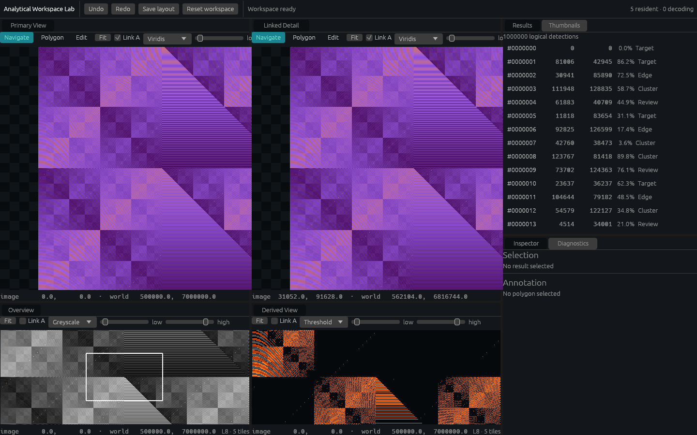

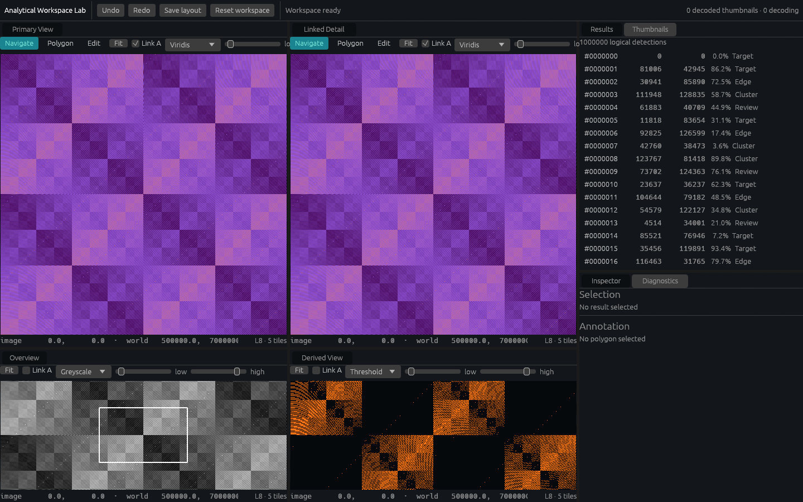

### Camera-derived scalar rendering


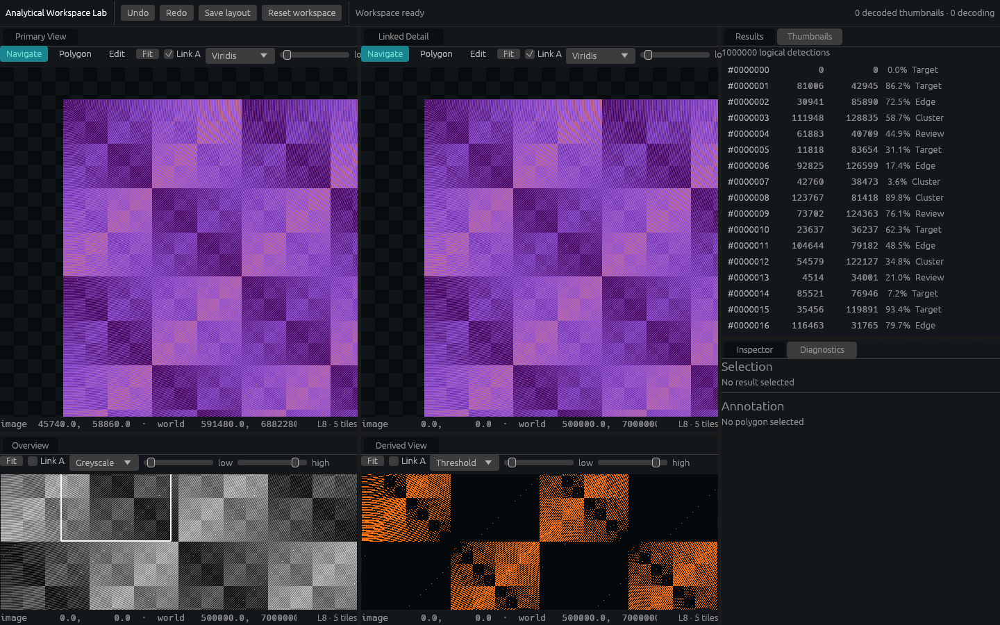

### Dock rearrangement and restoration

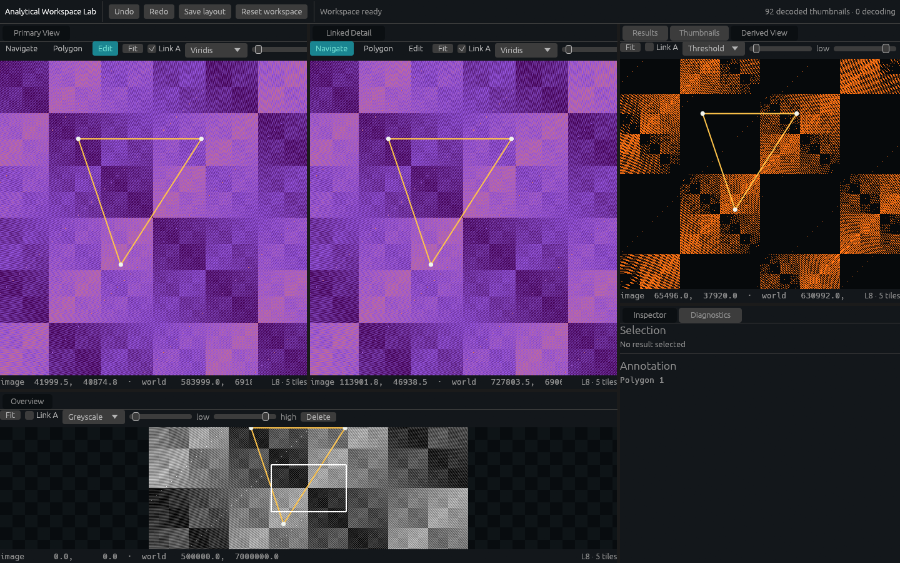

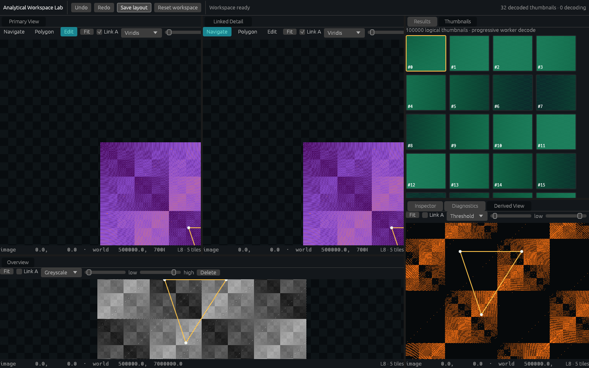

### Progressive data and virtualisation

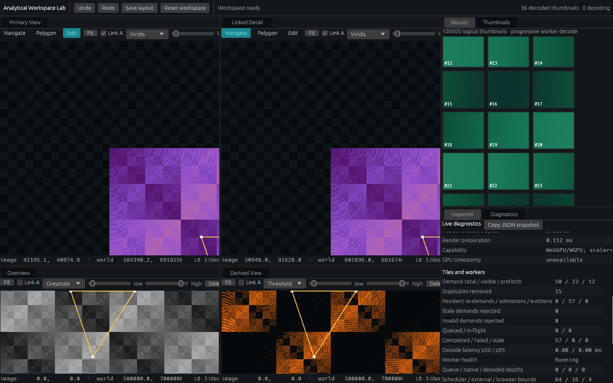

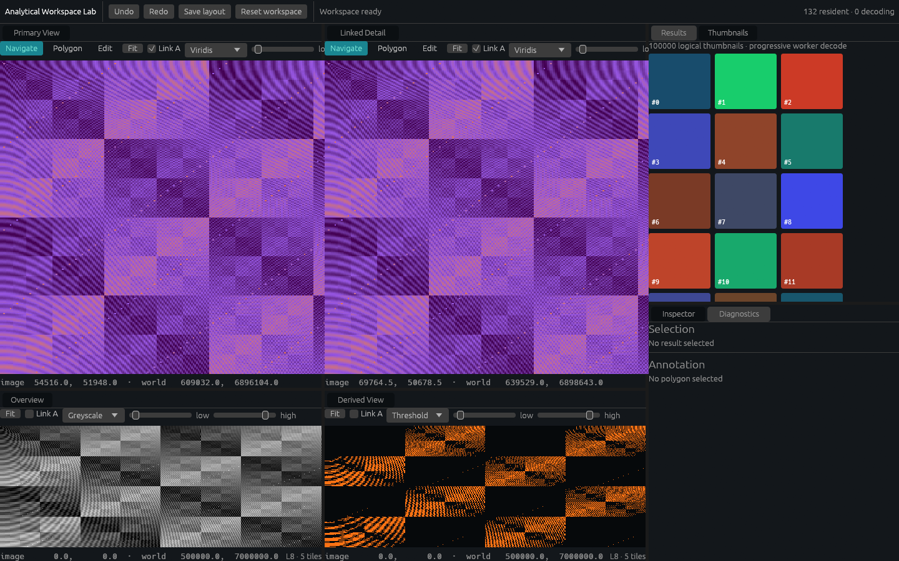

### Vector editing

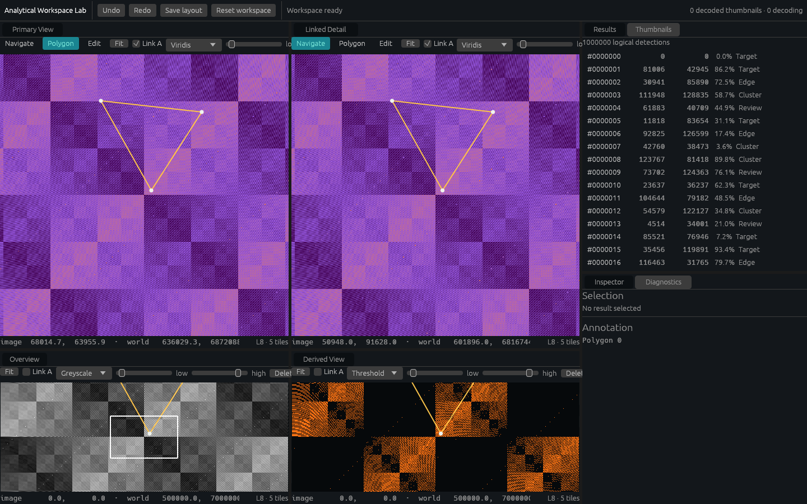

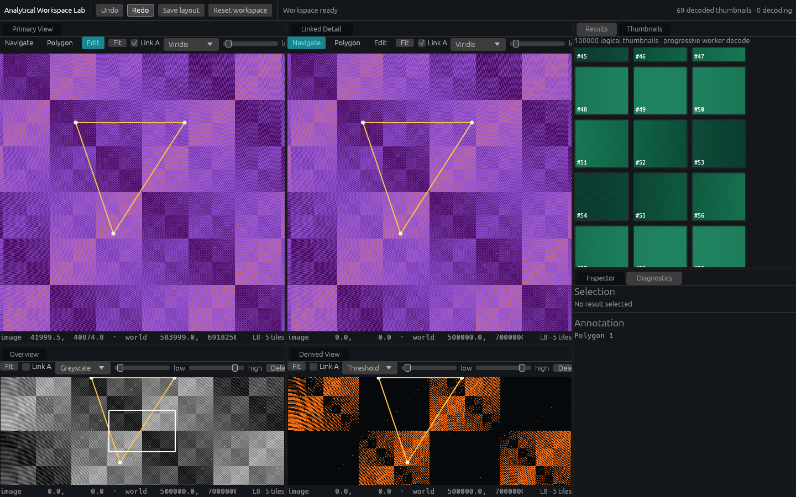

### Responsive restore probes

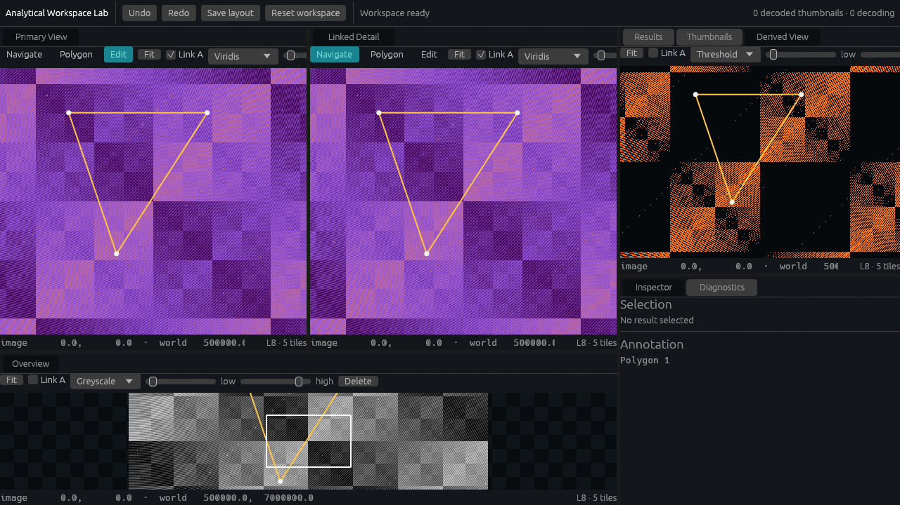

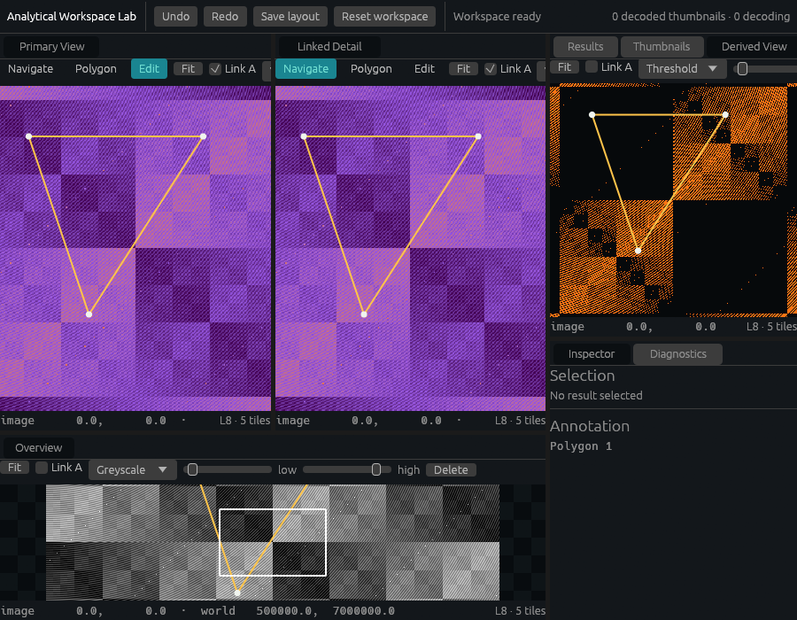

## Known issues and deferred work

- Native runtime evidence uses Mesa llvmpipe under Xvfb because the development session has no physical display. This verifies native integration and interactions, not discrete-GPU performance. A physical-adapter run is useful follow-up evidence, not a blocker for the current functional slice.
- Browser WebGPU exposes the backend but not a useful adapter name in this automation configuration. The snapshot leaves the adapter string empty rather than inventing it.
- GPU timestamp data is unavailable. Renderer preparation and application CPU frame times remain explicitly CPU-side.
- The worker fixture demonstrates real compressed transport/decode but is not a production image codec or remote source. Network access, proprietary imagery and production CRS/codecs remain non-goals.
- Pane close/create behaviour was not added; the specification makes it conditional where supported. Reset restores every mandatory pane. If optional pane lifecycle becomes a real product need, extend the one canonical tree rather than introducing a second dock model.
- The current renderer positions resident scalar tiles from their image extents and the typed camera transform, validating scalar residency, camera-correct shader geometry, multiple physical viewports and progressive replacement. It does not yet claim production filtering, atlas packing or geospatial reprojection accuracy.
- The narrow 900-pixel layout remains usable and clipped to its canvas, but long tab/control rows become dense. Responsive control compaction can be considered after analytical workflows establish priority; it is not an architectural blocker.
- Framework APIs remain deliberately concrete and demo-driven. Generic effect systems, render graphs, public component libraries, WebGL fallback, accessibility replacement and arbitrary texture import remain deferred non-goals.

No upstream or environment blocker remains for a mandatory acceptance criterion.

## Recommendation

Continue with a specialised layer above egui and deepen the runtime/renderer boundary incrementally. The canonical workspace, narrow pane interface, typed render requests, shared wgpu resources, workers, virtualisation and event-driven scheduling all survived native and browser execution without requiring an alternative GUI core.

The next empirical increment should remain usage-led: exercise a representative analytical workflow with real source I/O before generalising further framework APIs. Retain the canonical workspace, typed render plan, desired-set scheduler, strict token protocol and semantic evidence surface. Do not introduce a generic effect system, render graph or alternative GUI substrate without a new measured problem that these concrete boundaries cannot solve.
