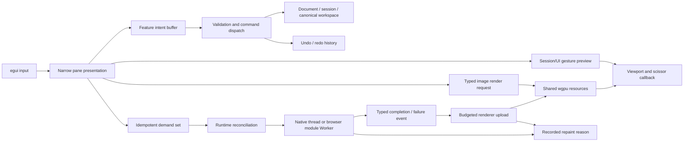

# Analytical Workspace Lab vertical-slice report

Date: 27 August 2026

Specification: [`vertical-slice-goal.md`](vertical-slice-goal.md)

Licence: Apache-2.0

## Summary

Polyorama now contains a runnable, application-shaped analytical workspace built from one Rust application model for native desktop and WebAssembly/WebGPU. The default serialisable dock workspace contains four separately interactive GPU image panes plus Results, Thumbnails, Inspector and Diagnostics. It exercises progressive LZ4-decoded scalar tiles, camera linking, world-coordinate polygon editing with undo/redo, virtual collections, persistence, explicit repaint scheduling and structured instrumentation.

The complete release verification passed on both targets. The native binary was launched under a user-space Xvfb display and rendered through wgpu's OpenGL backend on Mesa llvmpipe. The WebAssembly build was launched in headless Chromium with real WebGPU, a module Web Worker and persisted browser storage. Both paths were interacted with and captured; neither result rests on compilation alone.

The architectural hypothesis is supported: this slice did not reveal a need to replace egui. A narrow egui integration layer can present a canonical retained workspace and submit typed work into one renderer-owned wgpu resource universe. The strongest measured limitation is currently fixture production during rapid zoom, not egui presentation: the release browser run records a material high-tail cost for that scenario because deterministic scalar generation and LZ4 compression happen before worker dispatch. This is retained as a measured follow-up rather than hidden by an unprofiled rewrite.

Important limitations are documented below. In particular, native evidence uses a software adapter, browser adapter naming is unavailable, GPU timestamps are unavailable, and the synthetic data/decoder is an architectural fixture rather than a production image codec.

## Architecture

### Crates and ownership

| Component | Responsibility | Enforced boundary |
| --- | --- | --- |
| `workspace-core` | Typed IDs and coordinates, document/session state, canonical `Workspace`, intents, commands, undo/redo, renderer-independent demand and diagnostics types, virtual-range calculations | No egui, eframe, wgpu, web or windowing dependency |
| `workspace-runtime` | Demand reconciliation, resource state machine, priorities/generations/failures, common decode protocol, native worker, browser request queue, LZ4 decode, CPU cache policy and runtime metrics | No egui or wgpu dependency; workers receive bytes and typed keys only |
| `workspace-render-wgpu` | Typed `ImageRenderRequest`, scalar textures, WGSL display pipeline, shared residency, upload budget, physical viewport/scissor rendering and renderer metrics | Depends on wgpu, not egui; creates no device or queue |
| `workspace-ui-egui` | Canonical dock-tree presentation, semantic UI identity, typed viewport allocation/input translation and the hidden `egui_wgpu` callback bridge | The only framework crate that understands egui |
| `analytical-workspace-lab` | Demo composition, narrow pane projections/sinks, persistence, synthetic source selection, native and browser entry points | Owns orchestration, not reusable GPU/runtime internals |
| `polyorama-tile-worker` | Separate browser Worker Wasm entry point using the common runtime protocol | No UI or GPU object is accepted or owned |
| `xtask` | One deterministic verification entry point and mechanical architecture checks | Fails rather than silently weakening a target check |

State ownership follows the specification: annotations are document state; dock nodes, pane configuration and active pane are workspace state; selection, cameras, links, tools and gesture previews are session state; drag/hover geometry is UI behaviour; texture/pipeline/cache/upload state is renderer-owned; and demands, generations, failures and worker queues are runtime-owned. Egui memory is not authoritative for document, workspace or selection state.

### Frame flow



An intent records a feature-scoped request. Validation creates a durable command; the history applies it and supplies undo/redo. Gesture previews remain transient and a completed camera drag, vertex drag or polygon construction produces one command. No asynchronous domain effect was needed in this fixture: persistence is an explicit shell operation, while decode work is expressed as idempotent demand and typed runtime events rather than disguised as commands. The distinction remains mechanical in `PaneOutputs`, `ImageIntent`, `Command`, `TileDemand`, `DecodeEvent`, `ImageRenderRequest` and `RepaintReason`.

`workspace_core::Workspace` is the only dock-tree representation. The egui presenter walks that tree directly and keeps only a transient split preview; it has no mirrored docking model. Stable `DockNodeId` and `PaneId` values survive rearrangement and JSON restoration. Releasing a splitter emits one undoable `ResizeSplit` command, while pane drops modify the canonical tree and prune vacated splits deterministically.

The application obtains eframe's wgpu render state once and installs one `ScalarRenderer` in callback resources. Every pane callback receives that same device and queue. Renderer-owned `R16Uint` textures, pipelines, buffers, bind groups and cache entries are shared by tile key. Each tile's image extent is transformed through the request camera into viewport geometry before the custom shader draws it, so pan and zoom affect the scalar raster itself. The callback bridge converts egui allocation and clipping into physical viewport/scissor rectangles; pane code does not see a device, queue, render pass or persistent GPU object.

Native decode uses a named background thread and an explicit egui repaint waker. Browser decode uses a real module `Worker`, a separately built worker Wasm package and the same serialisable `DecodeRequest`/`DecodeEvent` protocol. Only decoded CPU buffers return for GPU upload. Repaints are requested for recorded interaction, command, completion or pending-upload reasons; there is no unconditional frame request.

## Acceptance matrix

`Verified` means an automated test, runtime observation, screenshot, mechanical boundary check, or a combination of those sources directly exercised the claim.

| ID | Criterion | Status | Concrete evidence | Notes |
| --- | --- | --- | --- | --- |
| A01 | Required document/workspace/session/UI/GPU/runtime ownership; no authoritative domain state in widget memory | Verified | `app.rs`, `panes.rs`, `diagnostics.rs`; `cargo xtask architecture` | Selection and layout live in Rust models. UI behaviour contains only transient camera drag/pointer state. |
| A02 | Egui is immediate presentation through narrow pane APIs | Verified | `PanePresenter`/`PaneSurface`; architecture source scan | Pane code has no mutable complete app/runtime/workspace or wgpu device/queue access. |
| A03 | Intent, command, event, demand, render request and repaint outputs remain distinct | Verified | `ImageIntent`, `Command`, `DecodeEvent`, `TileDemand`, `ImageRenderRequest`, `RepaintReason`; command validation tests | Decode is demand/event work; persistence is a shell operation. No speculative effect abstraction was added. |
| A04 | Live interaction preview and one durable command per completed gesture | Verified | `GesturePreview`; `complete_gesture_is_one_command`; `splitter_gesture_is_one_undoable_workspace_command`; native polygon/edit/undo/redo sequence | Camera, polygon and splitter previews are painted in the gesture frame; history gains one record at completion. |
| A05 | Exactly one canonical, versioned dock tree with stable IDs, splits, tabs, resizing, active pane and drag/drop | Verified | Stable `DockNodeId`; node/pane invariant, rearrangement, schema and round-trip tests; `browser-rearranged-dock.png`; native restored layout | Optional close/create was not implemented because it is conditional “where supported”; all mandatory panes remain restorable through Reset. |
| A06 | One shared wgpu device/queue and renderer resource universe for all viewports | Verified | `ScalarRenderer` is inserted once from `CreationContext::wgpu_render_state`; architecture scan rejects viewport device creation; diagnostics report four GPU viewports | No texture-import or per-pane device architecture exists. |
| A07 | Typed render plan and correct logical/physical viewport, scale, clipping, focus and pointer-local mapping | Verified | `ViewportAllocation`, `PhysicalViewport`, `ImageRenderRequest`, camera-to-NDC and bounded-quad renderer tests, callback `viewport_in_pixels`/`clip_rect_in_pixels`; clean-edged before/after browser captures; resize smoke | All four callbacks render inside their allocated pane; camera pan/zoom transforms tile geometry and the six-vertex quad cannot rasterise outside a tile's projected bounds. |
| A08 | Semantic identity is stable across rearrangement | Verified | IDs are scoped from window/pane/feature/domain IDs; pane stability and restored-dock tests | No call-order counter is used as semantic identity. |
| A09 | Typed UI, physical, viewport, image and world coordinate spaces plus deterministic affine transform | Verified | Coordinate newtypes and affine round-trip test; viewport status lines; world-coordinate annotations | Screen tuples do not cross the domain/render boundary as ambiguous coordinates. |
| A10 | Agent-friendly dependency direction and durable rules | Verified | `cargo xtask architecture`; `AGENTS.md`; workspace crate graph | Core reducers run with no window/GPU. No fork or general GUI core was introduced. |
| D01 | Deterministic scalar virtual raster ≥131072², 256² tiles, multiresolution, compressed worker path, never fully allocated | Verified | `TILE_SIZE`, `PYRAMID_LEVELS`, `visible_tile_demands`, deterministic tile function and LZ4 decode test; worker runtime evidence | Allocation is per demanded tile only. |
| D02 | At least 1,000,000 deterministic logical results without a million row structures | Verified | `RESULT_COUNT`, `result_at`, virtual-row tests; Diagnostics screenshot | Rows are calculated from index and stable `ResultId`. |
| D03 | At least 100,000 logical thumbnails, progressively demanded without creating/requesting all | Verified | `THUMBNAIL_COUNT`, virtual-grid test, Source 2 worker demands; thumbnail screenshots and diagnostics | Visible cells plus two overscan rows are requested. |
| W01 | Default workspace contains four GPU views and Results, Thumbnails, Inspector, Diagnostics | Verified | Default dock invariant lists panes 1–8; native/browser default screenshots; readiness asserts pane count 8 | Results/Thumbnails and Inspector/Diagnostics are tab stacks. |
| F01 | Resize, tabs, horizontal/vertical dock drops, activation, reset, save and deterministic restore | Verified | Playwright splitter and pane drag; native splitter/drag/save/restart; round-trip and schema tests | Empty source nodes are pruned after moves. |
| F02 | Non-RGBA scientific pixels retained and mapped by a custom shader with controls | Verified | Renderer creates `R16Uint` textures and WGSL `textureLoad`; Viridis, greyscale, threshold and window controls; capability diagnostics | No CPU RGBA conversion is used for source tiles. |
| F03 | Independent pan, pointer-centred zoom, fit, coordinates, link/unlink, explicit propagation, overview footprint/recentre | Verified | Camera/link and renderer-geometry tests; browser exact camera equality, unlink/relink and differing before/after compositor captures; native linked-camera screenshot and result/overview interactions | Primary and Linked Detail begin in Link A and can leave/rejoin it. |
| F04 | View-derived bounded tile demand, dedupe, priority, stale/failure handling, hidden suppression, coarse-first placeholder | Verified | Demand derivation/dedupe/priority/coarse-first/hidden tests; stale and terminal-failure tests; placeholder painter | Coarsest same-priority coverage is explicitly ordered ahead of fine tiles. |
| F05 | Common protocol; native background decode; actual browser Worker; no UI/GPU worker ownership; completion repaint | Verified | Native worker thread, module Worker source and worker Wasm; LZ4 test; browser worker completion assertion; idle audit | Browser worker calls `request_repaint`; app records `WorkerCompletion`. |
| F06 | Bounded configurable shared GPU cache, deterministic eviction/accounting and per-frame upload budget; all semantic states | Verified | 64 MiB cache/4 MiB upload diagnostics; LRU-touch, eviction/re-demand, shared-residency, upload and invalidation tests; renderer-to-runtime eviction bridge | Fixed 128 KiB tiles are smaller than the upload/cache budgets; evicted keys return to `Missing` and can be demanded again. |
| F07 | Polygon preview, commit, selection, vertex move, delete, undo/redo, coordinates and linked display | Verified | Command/coalescing/validation tests; native scripted creation/edit/delete/undo/redo; native/browser polygon screenshots | Durable polygons store `WorldPoint` vertices. |
| F08 | Million-row virtual result table, bounded overscan, stable selection and recenter | Verified | Virtual-row and stable-selection tests; browser result scroll profile; native select/recentre action; diagnostics | Default materialisation is far below 500 rows (16 in the captured default snapshot). |
| F09 | Two-dimensional 100k thumbnail grid, bounded visible/overscan demand, placeholders, stable selection and recenter path | Verified | Virtual-grid test; browser/native gallery scroll screenshots and worker completions | Thumbnail and result IDs are the same authoritative identity. |
| F10 | GPU view, results, thumbnails and inspector converge on authoritative session selection; focused command routing | Verified | `Session::selected_result/selected_annotation`; explicit selection intents; stable-selection test; active-pane keyboard guards | Undo/redo is shell-routed; fit/delete/commit are pane-context routed. |
| F11 | Versioned persistence of canonical layout, pane display, camera links and active pane; browser local storage; visible reset | Verified | `PersistedState`; unknown-schema and round-trip tests; Playwright local-storage/reload assertion; native save/restart screenshot | JavaScript only boots Wasm/Worker and does not mirror state. |
| S01 | Event-driven repainting with auditable reasons and no deliberate warmed-idle loop | Verified | `RepaintReason` diagnostics; Playwright frame 147 remained 147 for 700 ms | Splitter uses egui's interaction repaint while dragged; no unconditional application repaint exists. |
| I01 | Live frame/UI, workspace, renderer, tiles/workers/cache/upload and virtualisation diagnostics | Verified | Diagnostics pane/screenshot and structured browser snapshot | GPU timestamp is explicitly `unavailable`, not relabelled CPU time. |
| I02 | Structured spans around frame, command, demand, decode, upload, eviction, render preparation, viewport and layout serialisation | Verified | Source span inventory; native subscriber; tracing `log` fallback reaches the browser web logger | Both target builds compile the same instrumented operations. |
| I03 | Copy/save structured snapshot with versions, backend, viewports, budgets, datasets and counters | Verified | “Copy JSON snapshot”; `browser-diagnostics.json` | Snapshot includes pinned dependency versions; browser adapter name is unavailable and remains empty. |
| I04 | Honest release observations for all eight specified scenarios, with environment and unavailable metrics distinguished | Verified | `browser-performance.json` and Performance observations below | Splitter/pane-drag observations are additional. |
| V01 | All specified focused automated tests run without UI/GPU where required | Verified | 21 `workspace-core`, 9 `workspace-runtime` and 3 renderer geometry tests in `cargo test --workspace` | Covers dock, schema, IDs, links, coordinates, validation, history, camera and bounded-raster geometry, demand, cache, eviction, invalidation, upload, virtualisation and stable selection. |
| V02 | Native release actually launched and required interactions captured | Verified | `tools/native-smoke.sh`, runtime log, seven native screenshots | Failure scan rejects panic and wgpu fatal errors. |
| V03 | Browser Wasm actually launched in a real browser, checked and interacted with | Verified | Playwright readiness/dimensions/renderer/worker checks, exact linked-camera assertions, full-compositor pixel-difference check, console failure hooks, pan/zoom/split/drag/save/reload and screenshots | Also restored at 1280×720 and 900×700. |
| V04 | Mechanical architecture verification | Verified | `cargo xtask architecture` output | Checks dependency trees, narrow pane source, one Workspace definition and no renderer device creation. |
| V05 | One documented command runs format, native+Wasm lint, tests, architecture, release builds and both runtime smokes | Verified | `cargo xtask verify`; README and xtask help | The command completed successfully on 27 August 2026. |
| L01 | Polyorama code is Apache-2.0 and stated non-goals/boundaries remain intact | Verified | Full SPDX Apache-2.0 `LICENSE`; Cargo `license = "Apache-2.0"`; architecture scan and diff review | No network data service, proprietary data, egui/wgpu fork, generic GUI core, render graph or WebGL fallback was added. |

### Mandatory invariant cross-check

| Mandatory invariant from Section 11 | Evidence IDs |
| --- | --- |
| Four image viewports use one shared wgpu device | A06, W01, F02 |
| A scalar non-RGBA texture is sampled through a custom shader | F02 |
| The complete raster is never allocated | D01 |
| Duplicate tile demand results in at most one active decode | F04, F05 |
| Multiple views share one resident tile | F06 |
| Upload and cache budgets are respected | F06, I01 |
| Hidden panes do not issue high-resolution visible demand | F04 |
| Million-row and 100k-thumbnail collections remain virtual | D02, D03, F08, F09 |
| Selection is authoritative and shared | F10 |
| Camera links and gesture coalescing are explicit/testable | F03, A04, F07 |
| Restoration uses the canonical workspace | A05, F11 |
| Warmed idle does not deliberately repaint | S01 |
| Native/browser use the same Rust domain/workspace model | A01, F05, V02, V03 |
| Workers own no UI/GPU objects | F05, V04 |
| Diagnostics expose evidence for the claims | I01, I03 |

### Definition-of-done cross-check

Every checkbox in Section 16 maps to direct evidence below; no row is closed by build success or narrative alone.

| Definition-of-done criterion | Evidence IDs |
| --- | --- |
| Native build ran successfully | V02, V05 |
| Browser build ran successfully in a real browser | V03, V05 |
| Four independent panes, one device | A06, W01 |
| Cameras link and unlink | F03 |
| Non-RGBA scalar custom shader | F02 |
| Large progressive virtual raster, no full allocation | D01, F04 |
| Compressed native/browser worker decode | F05 |
| Cross-viewport demand reconciliation | F04 |
| Bounded, instrumented residency/uploads | F06, I01 |
| Worker completion explicitly repaints | F05, S01 |
| No deliberate idle repaint loop | S01 |
| Canonical tabs/splits/resize/drag/drop workspace | A05, F01 |
| Layout serialises/restores/round-trips | F11, A05 |
| Complete polygon editing and undo/redo | F07 |
| Live preview/coalesced commands | A04, F07 |
| Million-row result virtualisation | D02, F08 |
| 100k-thumbnail progressive virtualisation | D03, F09 |
| Result/thumbnail/viewport shared selection | F10 |
| Result/thumbnail recenter path | F08, F09 |
| Complete diagnostics surface | I01 |
| Structured diagnostic export | I03 |
| GPU-free core reducers/reconciliation tests | V01, V04 |
| Required dependency boundaries | A10, V04 |
| Single documented verification command | V05 |
| Native and browser screenshots | V02, V03, Screenshots below |
| Honest release observations | I04 |
| Durable `AGENTS.md` guidance | A10 |
| Report maps every criterion to evidence | This matrix and both cross-checks |
| No criterion rests only on expectation/compilation/narrative | V01–V05 and linked runtime artefacts |

## Verification commands

Canonical command, run from the repository root:

```text
cargo xtask verify
```

It passed and ran, in order:

```text
cargo fmt --all --check
cargo clippy --workspace --all-targets --all-features -- -D warnings
cargo clippy --target wasm32-unknown-unknown \
  -p analytical-workspace-lab -p polyorama-tile-worker -- -D warnings
cargo test --workspace
cargo xtask architecture
cargo build --workspace --release
cargo build --release --target wasm32-unknown-unknown \
  -p analytical-workspace-lab -p polyorama-tile-worker
wasm-bindgen ... analytical_workspace_lab.wasm
wasm-bindgen ... polyorama_tile_worker.wasm
npm ci
npx playwright install chromium
npm run browser-smoke
bash tools/native-smoke.sh
```

Summary: formatting passed; native and Wasm clippy passed with warnings denied; all 33 focused core/runtime/renderer tests passed; architecture boundaries passed; release native and both release Wasm packages built; Playwright browser smoke passed; native release smoke passed. The browser canvas was 1440×900 with eight registered panes, `wgpu-scalar` readiness, four GPU render jobs and completed Worker decodes. Its linked cameras matched exactly after pan and zoom, while before/after compositor captures differed and showed bounded, clean-edged tiles. The responsive reload probes also produced non-zero 1280×720 and 900×700 canvases. Native smoke reported `GL/llvmpipe, 1440x900` and found no panic or fatal wgpu error.

Verification host:

| Item | Observed value |
| --- | --- |
| OS/CPU/memory | Arch Linux, kernel 7.1.3, x86_64; AMD Ryzen 9 9950X3D; 32 logical CPUs; 91 GiB RAM |
| Rust | `rustc 1.97.1 (8bab26f4f 2026-07-14)`, Cargo 1.97.1, edition 2024 |
| Web tooling | wasm32 target; wasm-bindgen CLI 0.2.127; Node 25.8.2; Playwright 1.62.1 |
| Principal locked dependencies | eframe/egui/egui-wgpu 0.36.1; wgpu 30.0.1; wasm-bindgen 0.2.127; tracing 0.1.44 |
| Lockfile identity | SHA-256 `e7c09a55bed1298e294d88bf85fe311b82d834a2e1ffb93608e0ea14cf70d4cc` |
| Native graphics | wgpu OpenGL backend; Mesa llvmpipe LLVM 22.1.6 software adapter; Xvfb 1440×900 |
| Browser graphics | Headless Chromium 151.0.7922.34 through Playwright; `BrowserWebGpu`; WebGPU enabled; adapter name unavailable |

The Linux verification bootstrap downloads pinned user-space UI/X11 packages into ignored `.tools`; it does not mutate system packages. Internet access is needed on a cold run for those packages, Cargo/npm artefacts and Playwright Chromium.

## Performance observations

These values are directly measured application-side CPU frame samples from the release Wasm build in headless Chromium at a primary viewport of 1440×900. They are not GPU execution timings. The committed [`browser-performance.json`](vertical-slice-evidence/browser-performance.json) is the structured source.

| Scenario | Median | p95 | Direct observation |
| --- | ---: | ---: | --- |
| Initial loading | 0.9 ms | 37.3 ms | Nine samples; startup/first pipeline work dominates the tail. |
| Four visible GPU viewports while panning | 0.6 ms | 0.8 ms | Linked view updated during the gesture. |
| Warmed idle | n/a | n/a | Frame counter stayed 147 → 147 over 700 ms; no deliberate continuous repaint. |
| Rapid zoom/tile-level transitions | 0.7 ms | 126.3 ms | Tail spikes are material and reproducible enough to retain as follow-up. |
| Million-row result scroll | 0.6 ms | 0.9 ms | Only the visible/overscan range was materialised. |
| Thumbnail gallery scroll | 0.4 ms | 4.3 ms | Worker-requested visible cells and placeholders were exercised. |
| Polygon editing | 0.4 ms | 0.8 ms | Three vertices and commit across linked panes. |
| Saved workspace restore | 0.7 ms | 21.7 ms | Persisted rearranged dock restored after a full reload. |
| Splitter interaction (additional) | 0.4 ms | 5.9 ms | A transient preview resolved to one canonical, undoable split command. |
| Pane drag/drop (additional) | 0.3 ms | 0.6 ms | Derived View moved and the empty source split was pruned. |

Measured capability and counters from the restored browser snapshot include four GPU viewports/render jobs, one application render pass, 12 counted draw calls, a 64 MiB texture cache budget, 4 MiB upload budget, 655,360 resident texture bytes, zero in-flight decodes and zero failures. Dataset sizes are 1,000,000 results and 100,000 thumbnails.

The explanation for the rapid-zoom tail is an inference from source placement and the scenario: deterministic scalar fixture generation and LZ4 compression are currently performed while constructing a request, before the compressed payload is handed to the decoder worker. Worker decode itself remains off-thread. A follow-up profile should separate fixture generation/compression from reconciliation before changing the renderer or egui boundary.

GPU timestamp queries were unavailable on both captured capability profiles. The application reports them as unavailable. Native frame-time percentiles were not collected under the software/Xvfb adapter because they would not represent production hardware; native runtime evidence is functional. No untested native hardware-performance claim is made.

## Screenshots

### Default workspaces


### Camera-derived scalar rendering


### Dock rearrangement and restoration


### Progressive data and virtualisation


### Vector editing


### Responsive restore probes


## Known issues and deferred work

- Rapid zoom has a measured high-tail CPU cost in synthetic payload creation/compression before worker dispatch. Profile that stage independently and consider moving fixture production or using prebuilt compressed fixture blocks. Do not attribute this to egui without evidence.
- Native runtime evidence uses Mesa llvmpipe under Xvfb because the development session has no physical display. This verifies native integration and interactions, not discrete-GPU performance. A physical-adapter run is useful follow-up evidence, not a blocker for the current functional slice.
- Browser WebGPU exposes the backend but not a useful adapter name in this automation configuration. The snapshot leaves the adapter string empty rather than inventing it.
- GPU timestamp data is unavailable. Renderer preparation and application CPU frame times remain explicitly CPU-side.
- The worker fixture demonstrates real compressed transport/decode but is not a production image codec or remote source. Network access, proprietary imagery and production CRS/codecs remain non-goals.
- Pane close/create behaviour was not added; the specification makes it conditional where supported. Reset restores every mandatory pane. If optional pane lifecycle becomes a real product need, extend the one canonical tree rather than introducing a second dock model.
- The current renderer positions resident scalar tiles from their image extents and the typed camera transform, validating scalar residency, camera-correct shader geometry, multiple physical viewports and progressive replacement. It does not yet claim production filtering, atlas packing or geospatial reprojection accuracy.
- The narrow 900-pixel layout remains usable and clipped to its canvas, but long tab/control rows become dense. Responsive control compaction can be considered after analytical workflows establish priority; it is not an architectural blocker.
- Framework APIs remain deliberately concrete and demo-driven. Generic effect systems, render graphs, public component libraries, WebGL fallback, accessibility replacement and arbitrary texture import remain deferred non-goals.

No upstream or environment blocker remains for a mandatory acceptance criterion.

## Recommendation

Continue with a specialised layer above egui and deepen the runtime/renderer boundary incrementally. The canonical workspace, narrow pane interface, typed render requests, shared wgpu resources, workers, virtualisation and event-driven scheduling all survived native and browser execution without requiring an alternative GUI core.

The next empirical increment should profile and then isolate synthetic payload production during rapid level transitions, while retaining the current demand/event protocol. In parallel, extract only the components already exercised twice—canonical docking presentation, viewport allocation/callback bridge, demand reconciliation and diagnostics snapshotting. Do not generalise a public framework API or replace egui until a representative profile identifies a lower-level boundary that remains material after demand control, virtualisation and off-thread production are in place.
